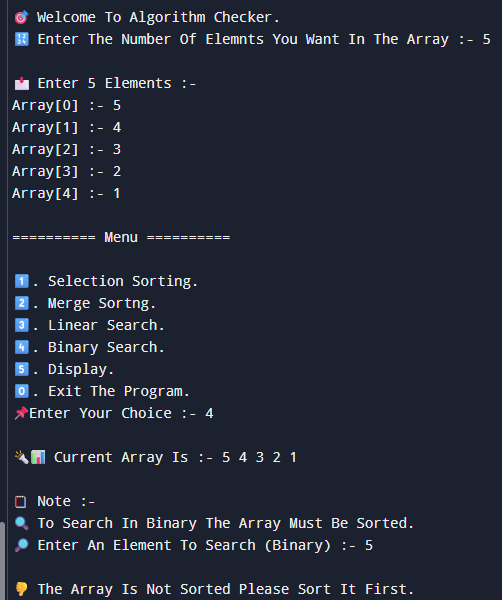

# Pr-10-Categorizing-Shivam

# 🔠 Project: Categorizing Algorithms in C++

## 📝 Overview
This C++ project focuses on implementing and testing **two sorting algorithms** and **two searching algorithms** through an interactive menu-driven program. It allows the user to:
- Enter an array
- Sort it using Selection or Merge Sort
- Search using Linear or Binary Search
- View the array
- Exit the program gracefully

---

## 🖥️ Features
- 📚 Selection Sort and Merge Sort
- 🔍 Linear Search and Binary Search
- 📊 Interactive menu for operations
- 🚫 Binary search warning on unsorted data
- ✅ Clean exit confirmation

---

## 🧪 Sample Output

### 📸 Screenshot 1: Input + Binary Search on Unsorted Array  
![Output 1] 

Highlights:
- Entered array: `5 4 3 2 1`
- Tried Binary Search before sorting — program alerts the user.

---

### 📸 Screenshot 2: Sorting and Display  

![Output 2] 

Highlights:
- Selection Sort successfully executed
- Array after sorting: `1 2 3 4 5`

---

### 📸 Screenshot 3: Program Exit  
![Output 3] 

Highlights:
- User selects option `0` to exit
- Program ends gracefully with a success message

---
